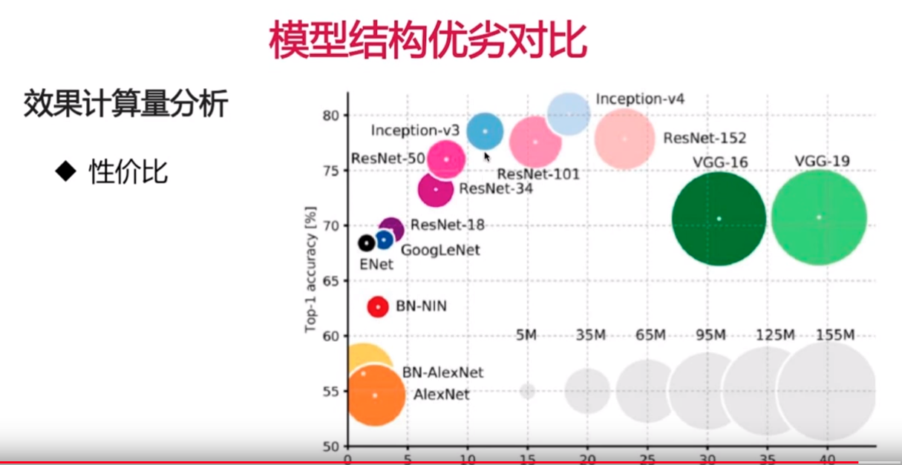

**alexnet**
````
1:首次使用relu,双通道卷积层同时使用两个gpu,1,2,5层卷积后跟maxpoolinbg
2:最后在全连接层合并
3:卷基层输出公式  
  输出大小=(输入大小-卷积核+padding)/stride+1
   eg:输入224*224,stride=4,卷积核11*11.输出大小为55
4:dropout 的理解
  1)应用在全连接层,全连接层参数太多.容易过拟合
  2)为什么可以解决过拟合
     组合解释:每次dropout相当于训练了不同的子网来进行组合,组合的行为提升了结果
     数据解释:dropout 相当于增加了训练数据,进行了数据增强
5: pooling层的反向 传播:
   maxpooling:只传播到最大值所在的神经元
   meanpooling:平均的传播到所有的神经元
````

**vggnet**
````
1:比alexnet 更深,多使用3x3卷积核,2个3x3相当于一个5x5.三个3x3相当于一个7x7(多一次非线性变化,参数量降低28%)
  1x1的卷积核相当于一个非线性变换(把多个通道进行合并,不会丢失信息)
2:LRN(alexnet中有用到,过时) 局部归一化,把相邻的5个通道进行归一化
3:训练技巧
  先训练浅层网络,再训练深层网络
  多尺度输入:不同尺度训练多个分类器,再做组合
````

**ResNet**
````
残差网络
1:加深层次也不会提升结果,甚至会导致准确率下降.
2:加入恒等变换的子结构来解决问题,直接引入两层前的输入加和后进行relu
````

**InceptionNet**
````
1:遇到的问题是更深的网络容易过拟合,更深的网络计算量过大,稀疏网络减少了参数量但是没有减少计算量(疑惑?)
2:V1引入了分组卷积(inception结构),优势
  一层上同时使用多种卷积核
  不同组之间的feature不交叉减少计算量
3:像resnet一样插入到不同卷积层之间
4:v2结构中用3x3替换了5x5
5:v3结构中用1x3和3x1 替换了3x3,参数降低了33%
6:V4结构引入了skip connection(resnet中的残差连接层)
````

**MobileNet**


1:引入了深度可分离卷积

把参数中的乘法变成加法,大大减少了参数量
由此带来的精度损失在10%以内


**Inception-Resnet**


